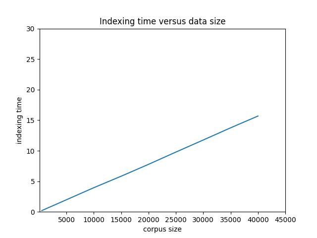
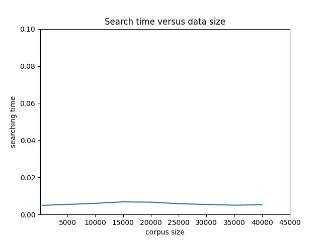
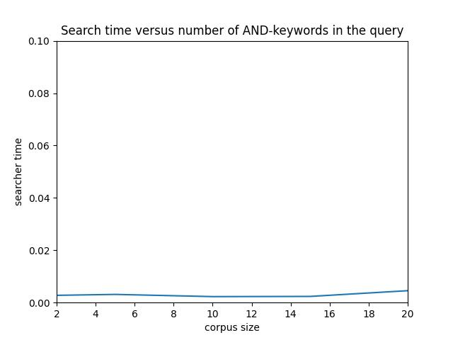
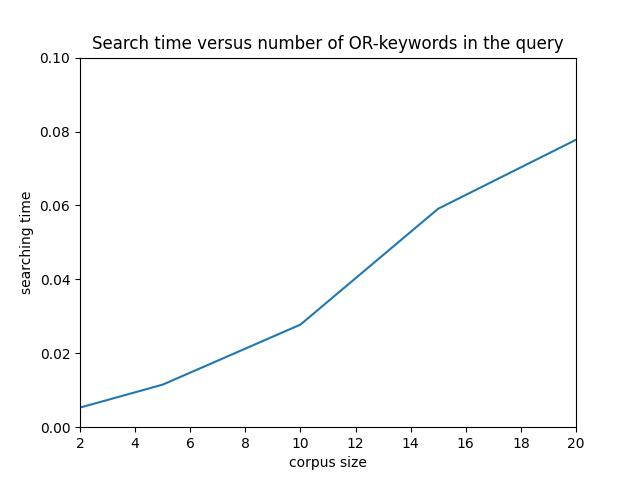

# Text-index-and-search


##### Compile
```
cmake .
make
```

##### Execute
```
./indexer <dataset_metadata> <index_name>
./searcher <index_name> <top-k> <keyword1> <keyword2> ...
./ssearch <index_name>
```

**Add '+' in front of keywords to execute AND search**










